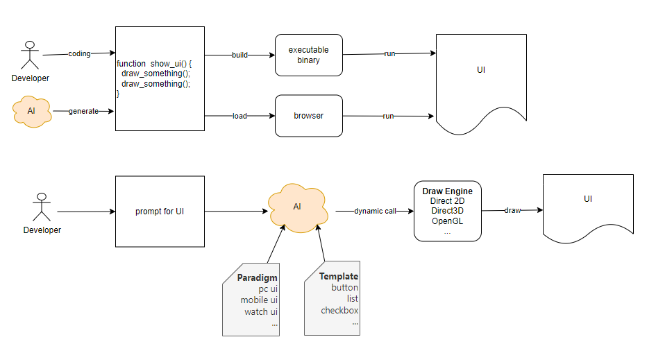

# AIGUI
New idea about AI draw UI directly, skip coding.

# Why this project
When i researching AI , I found that many projects focus on how to make AI replace humans in writing code. 

This reminds me of another thing, people are developing robots that can accompany children, so that parents can work wholeheartedly. 

Why not let robots work instead of allowing parents to have more time to accompany their children? This is completely inhumane.

So, I'm wondering why we can't let AI directly drive the graphics engine to draw the UI, and present it directly on the screen? 

Does it have to generate some kind of code? 

So I drew down this idea.

# Next
Try to let AI drawing a simple shape on the canvans directly with out code.
